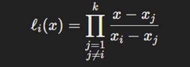
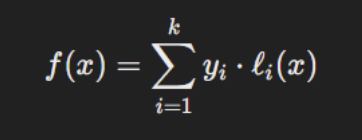

# Reed-Solomon Codes
## Intro to Reed-Solomon

Reed-Solomon Codes are a type of error-correcting code that work by fitting data to a polynomial. Say we send n integers across a communication channel. We will call this x_n. We select n points, called evaluation points, which we will call e_n. Any n integers can be fit to a unique polynomial of degree n - 1, so we can determine a unique polynomial so that f(e_n) = x_n for all n. 

Why does this help us? We can choose an additional k evaluation points, and plug them into our polynomial to find an additional k integers on the curve. If we then append these k values onto our original signal, our receiver can remake the original polynomial as long as k or less detectable errors occur. This is because the original polynomial is unique for any n points. If we have at least n points, i.e. k or less errors, we can choose any n of the correct points to remake the correct polynomial, and reevaluate at values where errors occurred to retrieve the original message.

## Implementing Reed-Solomon using Lagrange Interpolation

Evaluating the polynomial and adding redundant points are relatively trivial. The more difficult part is finding the unique polynomial that fits the input. The method used to achieve this is Lagrange Interpolation which works as followed. For each of our evaluation points, create a polynomial such that it evaluates to 1 at this evaluation point, and 0 at every other. This can be achieved by multiplying out terms for zeros of every other evaluation point, and then multiplying by a constant term to scale this point to 1.

A mathematical notation for this is shown below.

  

Once we have a so-called "basis polynomial" for each evaluation point, we scale each basis polynomial by its associated value at the evaluation point. We can finally sum each scaled basis polynomial to get the fit. This works because each scaled basis will be the associated value at that point and 0 everywhere else. Therefore, when they are all summed, each basis polynomial only contributes to the value at the evaluation point.

  

# Reed-Solomon over Finite Fields
## Using Finite Fields for Reed Solomon Codes

Using Reed-Solomon codes over finite fields works the same as in the real numbers, and is often actually preferred due to various efficiencies. One added efficiency of finite fields is its simple computation of inverses. To normalize each basis polynomial to an output of 1, we often need to multiply by an inverse value. For example, if the output at the evaluation point was originally 3, we would multiply by 1/3 or 0.3333. For computers, decimal or floating point calculation is orders of magnitude harder than integer addition. Evaluationg over finite fields allows us to have exclusively integer inverses. In this case, if we were operating over F_7, the inverse of 3 would be 5. Furthermore, this gives additional precision, since many real inverses, like 1/3, do not terminate. There are other benefits associated with using finite fields, such as reduced memory and simplified exponentiation, which we will cover later.

## Evaluation at Powers of Primitive Elements

For any finite field with a prime number of elements has some element that will will return every non-zero element of the field when raised to successive powers. We call this element a primitive element. For example, F_7 has a primitive element of 3, because 3^0 = 1, 3^1 = 3, 3^2 = 2, 3^3 = 6, 3^4 = 4, 3^5 = 5, 3^6 = 1 ... This sequence is cyclic every n - 1 terms, where n is the number of elements in the field. As a result of this, we can represent our evaluation points as powers of a primitive, as long as our evaluation points are non-zero. There are a few benefits to doing this.

First off, assume we has some polynomial fit x^4 + 2x^3 + x^2 + x + 1 in F_7. Raising different evaluation points to large powers like this is often very computationally intensive. By instead representing an element as a power of a primitive, i.e. 2 = 3^2, we can rewrite any exponenetiation in terms of the same base, i.e. 2^4 = (3^2)^4 = 3^8. This allows us to precompute and reuse the powers of the primitive element. Additionally, since the primitive element is cyclic in n - 1 = 6 elements, we can take the modulus of the resulting power and look up the output in our table of precomputed primitive powers.

